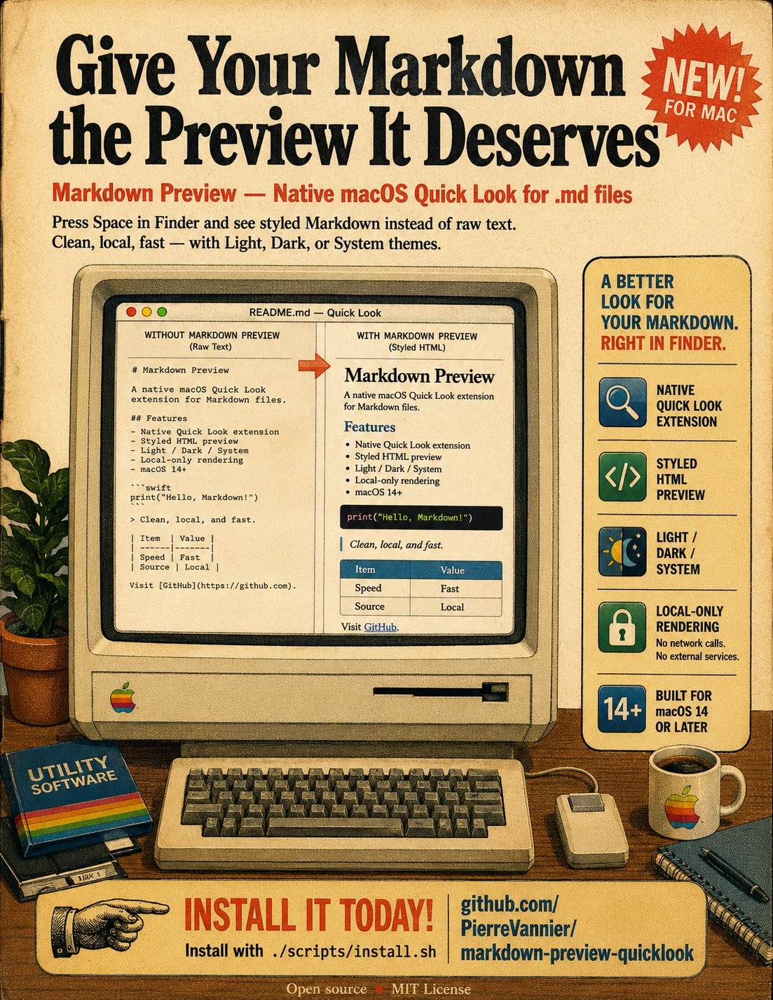

# Markdown Preview

Native macOS Quick Look preview extension for Markdown files.

It renders `.md` files as styled HTML in Finder's Quick Look panel instead of showing raw plain text.

<p align="center">
  
</p>

## Features

- Finder Quick Look preview for Markdown files.
- Polished light and dark mode styling.
- Theme selector: System, Light, or Dark.
- Local rendering only: no network calls and no external runtime services.
- Supports headings, emphasis, links, inline code, fenced code blocks, block quotes, lists, task lists, thematic breaks, tables, and local images.
- Handles common Markdown UTIs, including TeXShop's `com.unknown.md`, without changing your editor association.

## Security Model

- Rendered previews use a restrictive Content Security Policy.
- Remote images are not loaded; Markdown images must point to local files or `data:image/...` URLs.
- Links are only rendered for `http`, `https`, `mailto`, and `file` URLs.
- Very large Markdown files are skipped instead of being rendered inside Quick Look.

## Requirements

- macOS 14 or later.
- Xcode or Xcode command line tools with `xcodebuild`.
- [XcodeGen](https://github.com/yonaskolb/XcodeGen):

```sh
brew install xcodegen
```

## Install

```sh
git clone https://github.com/PierreVannier/markdown-preview-quicklook.git
cd markdown-preview-quicklook
./scripts/install.sh
```

The installer builds the app, installs it to:

```text
~/Applications/Markdown Preview.app
```

It also registers the Quick Look extension, resets Quick Look caches, and sets Markdown Preview as the Finder/Quick Look viewer for Markdown content types. Editor handlers are left intact.

## Release Package

Build a native macOS installer package:

```sh
./scripts/package.sh
```

The package is written to:

```text
release/MarkdownPreview-1.0.pkg
```

Double-click the `.pkg` to install. It copies the app to `~/Applications/Markdown Preview.app`, registers the Quick Look extension, resets Quick Look caches, and sets Markdown Preview as the Viewer handler for Markdown files.

The locally generated package is unsigned. For public binary releases, sign and notarize the `.pkg` with an Apple Developer ID Installer certificate.

## Signed Release

Create a notarized public package with Apple Developer ID certificates:

```sh
xcrun notarytool store-credentials "markdown-preview" \
  --apple-id "you@example.com" \
  --team-id "TEAMID" \
  --password "app-specific-password"

DEVELOPER_ID_APPLICATION="Developer ID Application: Name (TEAMID)" \
DEVELOPER_ID_INSTALLER="Developer ID Installer: Name (TEAMID)" \
NOTARYTOOL_PROFILE="markdown-preview" \
./scripts/notarize.sh
```

This writes:

```text
release/MarkdownPreview-1.0-signed.pkg
release/MarkdownPreview-1.0-signed.pkg.sha256
```

## GitHub Release

Prepare release assets with a package, checksum, and release notes:

```sh
./scripts/release.sh
```

This writes:

```text
release/MarkdownPreview-1.0.pkg
release/MarkdownPreview-1.0.pkg.sha256
release/MarkdownPreview-1.0-release-notes.md
```

Create a draft GitHub release:

```sh
./scripts/release.sh --draft
```

Publish directly:

```sh
./scripts/release.sh --publish
```

Tagged releases are also automated by GitHub Actions. Push a tag like:

```sh
git tag v1.0
git push origin v1.0
```

The workflow builds the package, uploads build artifacts, and publishes a GitHub Release for the tag.

## Use

In Finder:

- Select a `.md` file and press Space.
- Or enable the preview pane with `View > Show Preview`.

To choose the preview theme, open:

```text
~/Applications/Markdown Preview.app
```

Select `System`, `Light`, or `Dark`. Existing Quick Look windows may need to be closed and reopened before they pick up the new theme.

## Uninstall

```sh
./scripts/uninstall.sh
```

## Troubleshooting

If Finder still shows a plain-text preview after installing:

```sh
qlmanage -r
qlmanage -r cache
killall Finder
```

Then select the Markdown file again and press Space.

If TeXShop takes over Markdown previews, run the installer again. TeXShop registers `.md` as `com.unknown.md`; the installer explicitly sets Markdown Preview as the Viewer handler for that type while leaving TeXShop as the Editor.

## Development

Generate the Xcode project:

```sh
xcodegen generate
```

Build:

```sh
xcodebuild \
  -project MarkdownPreview.xcodeproj \
  -scheme "Markdown Preview" \
  -configuration Release \
  -derivedDataPath build/DerivedData \
  CODE_SIGN_IDENTITY="-" \
  CODE_SIGN_STYLE=Manual \
  DEVELOPMENT_TEAM="" \
  SDK_STAT_CACHE_ENABLE=NO \
  build
```

Install locally:

```sh
./scripts/install.sh
```

## License

MIT
