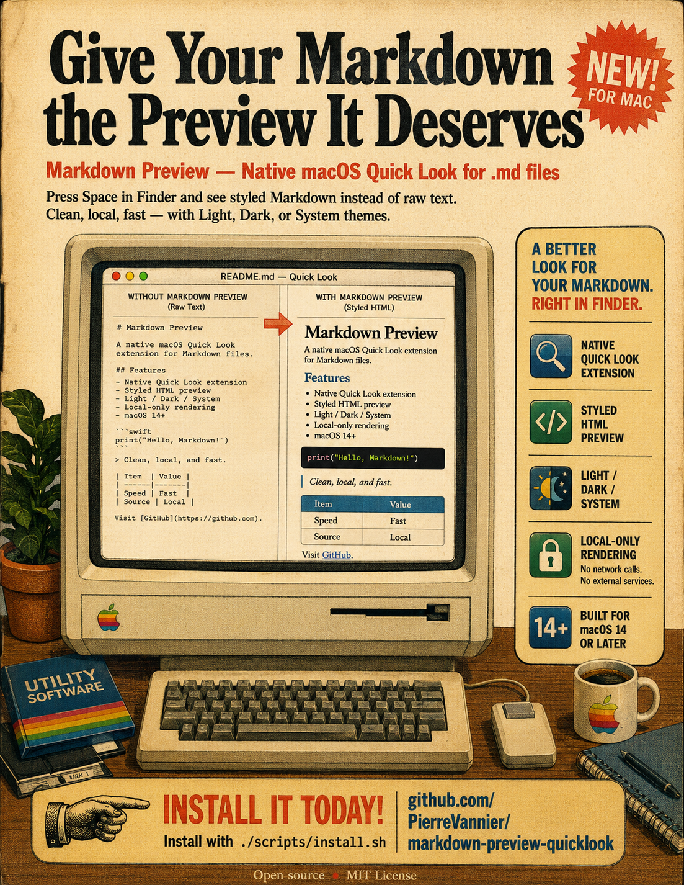

# Markdown Preview

This is a quick smoke-test file for **Finder Quick Look** rendering. It includes `inline code`, links, lists, a quote, a table, and a fenced code block.

## Why this approach

- Native Quick Look extension
- No browser extension or background process
- No external rendering service

- [x] Render styled Markdown
- [x] Support Finder Quick Look
- [ ] Ship signed release packages

> Good previews should feel like a clean document, not raw source text.
> Open Markdown Preview.app to switch between System, Light, and Dark themes.



| Feature | Status |
| --- | ---: |
| Headings | Ready |
| Tables | Ready |
| Code blocks | Ready |
| Task lists | Ready |
| Local images | Ready |

```swift
struct Preview {
    let fileName: String
    let renderer = "Quick Look"
}
```

---

Open this file from Finder to verify the extension.
